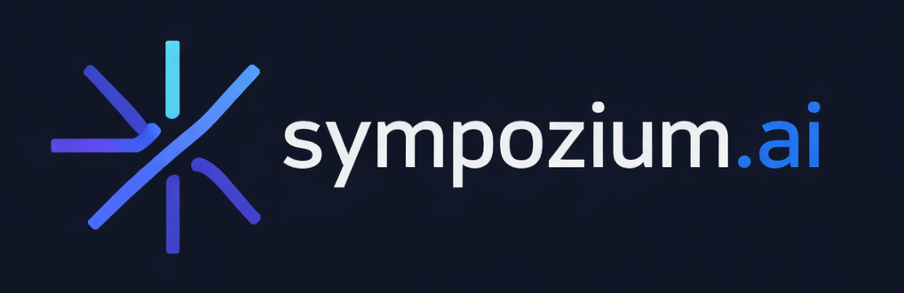

<p align="center">
  
</p>

<p align="center">

  <em>
  Every agent is an ephemeral Pod.<br>Every policy is a CRD. Every execution is a Job.<br>
  Orchestrate multi-agent workflows <b>and</b> let agents diagnose, scale, and remediate your infrastructure.<br>
  <b>GCP-native. Powered by Gemini on Vertex AI. Built for GKE.</b></em><br><br>
  Forked from <a href="https://github.com/AlexsJones/sympozium">AlexsJones/sympozium</a> &mdash; original by the creator of <a href="https://github.com/k8sgpt-ai/k8sgpt">k8sgpt</a>
</p>

<p align="center">
  <b>
  GCP-only fork &mdash; all non-Google services have been replaced with GCP-native equivalents.
  </b>
</p>

---

## What Changed: GCP-Only Fork

This fork transforms Sympozium into a **100% Google Cloud Platform** stack. Every non-Google dependency has been replaced with a GCP-native service. Here is a complete record of every change and the rationale:

### LLM Provider: Vertex AI Gemini

| Before | After | Rationale |
|--------|-------|-----------|
| OpenAI SDK (`openai-go/v3`) | Vertex AI REST API | GCP-native LLM |
| Anthropic SDK (`anthropic-sdk-go`) | Vertex AI REST API | GCP-native LLM |
| Azure OpenAI | Removed | Non-Google |
| Ollama | Removed | Replaced by Vertex AI |
| Default model: `gpt-4o-mini` | Default model: `gemini-2.0-flash` | Google's flagship model |
| `OPENAI_API_KEY` / `ANTHROPIC_API_KEY` | `GOOGLE_API_KEY` / `VERTEX_AI_API_KEY` | GCP credentials |
| Provider: `openai`, `anthropic`, `ollama` | Provider: `vertexai`, `gemini` | Unified GCP provider |

**Files changed:** `cmd/agent-runner/main.go`, `internal/webproxy/openai.go`, `go.mod`

### Communication Channels: Google Chat + Discord

| Before | After | Rationale |
|--------|-------|-----------|
| Slack | **Removed** &rarr; Google Chat | GCP-native messaging |
| Telegram | **Removed** &rarr; Google Chat | Non-Google |
| WhatsApp (whatsmeow) | **Removed** &rarr; Google Chat | Non-Google |
| Discord | **Kept** | Open-source, community standard |
| New: Google Chat | **Added** | GCP-native workspace integration |

**Files changed:** `channels/googlechat/main.go` (new), `channels/slack/main.go` (stubbed), `channels/telegram/main.go` (stubbed), `channels/whatsapp/main.go` (stubbed), `cmd/agent-runner/tools.go`, `images/channel-googlechat/Dockerfile` (new)

### Event Bus: Cloud Pub/Sub

| Before | After | Rationale |
|--------|-------|-----------|
| NATS JetStream | Google Cloud Pub/Sub | Fully managed GCP messaging |
| `nats.go` library | `cloud.google.com/go/pubsub` | GCP SDK |
| In-cluster NATS deployment | Cloud Pub/Sub (managed) | No infrastructure to manage |
| `EVENT_BUS_URL` env var | `GCP_PROJECT_ID` env var | Project-based configuration |

**Files changed:** `internal/eventbus/pubsub.go` (new), `internal/eventbus/nats.go` (stubbed), `go.mod`, `charts/sympozium/values.yaml`

### Container Registry: Artifact Registry

| Before | After | Rationale |
|--------|-------|-----------|
| `ghcr.io/alexsjones/sympozium` | `us-docker.pkg.dev/sympozium/sympozium` | GCP Artifact Registry |

**Files changed:** `charts/sympozium/values.yaml`, all Dockerfiles, all config manifests

### Database: Cloud SQL (PostgreSQL)

| Before | After | Rationale |
|--------|-------|-----------|
| Self-managed PostgreSQL | Cloud SQL for PostgreSQL | GCP-managed, same schema |

**Files changed:** `charts/sympozium/values.yaml` (added `gcp.cloudSqlInstance`)

### Observability: Cloud Trace + Cloud Monitoring

| Before | After | Rationale |
|--------|-------|-----------|
| OTel Collector (generic) | OTel Collector with GCP exporters | Cloud Trace + Cloud Monitoring |
| `otel/opentelemetry-collector` | `otel/opentelemetry-collector-contrib` | Includes `googlecloud` exporter |

**Files changed:** `charts/sympozium/values.yaml`, `config/observability/otel-collector.yaml`

### Skills: GCP-Centric

| Before | After | Rationale |
|--------|-------|-----------|
| `github-gitops` skill (gh CLI) | `gcp-gitops` skill (gcloud CLI) | Cloud Source Repositories |
| `llmfit` skill | Removed | Not GCP-native |
| Base image: gh CLI | Base image: `google/cloud-sdk:alpine` | gcloud CLI |

**Files changed:** `config/skills/`, `config/personas/`, `images/skill-github-gitops/Dockerfile`

### Dependencies Removed from go.mod

- `github.com/anthropics/anthropic-sdk-go`
- `github.com/openai/openai-go/v3`
- `github.com/nats-io/nats.go`
- `go.mau.fi/whatsmeow`
- `github.com/Azure/azure-sdk-for-go/sdk/*`

### Dependencies Added to go.mod

- `cloud.google.com/go/pubsub`
- `cloud.google.com/go/vertexai`

---

## Quick Start on GKE

### Prerequisites

- A GKE cluster
- `gcloud` CLI authenticated
- [cert-manager](https://cert-manager.io/) installed
- A GCP project with Vertex AI API enabled
- Cloud Pub/Sub API enabled

### Install

```bash
# Deploy CRDs and control plane
helm install sympozium ./charts/sympozium \
  --set gcp.projectId=YOUR_PROJECT_ID \
  --set gcp.location=us-central1

# Create a Vertex AI API key secret
kubectl create secret generic vertexai-key \
  -n sympozium-system \
  --from-literal=api-key=YOUR_GOOGLE_API_KEY

# Launch the TUI
sympozium

# Open the web dashboard
sympozium serve
```

### Environment Variables

| Variable | Description |
|----------|-------------|
| `GCP_PROJECT_ID` | Your GCP project ID |
| `GCP_LOCATION` | Vertex AI region (default: `us-central1`) |
| `GOOGLE_API_KEY` | Gemini API key |
| `VERTEX_AI_API_KEY` | Alternative Vertex AI key |
| `GOOGLE_ACCESS_TOKEN` | Service account access token (for Vertex AI) |
| `GOOGLE_APPLICATION_CREDENTIALS` | Path to service account JSON key |

---

## Why Sympozium?

Sympozium serves **two powerful use cases** on one Kubernetes-native platform:

1. **Orchestrate fleets of AI agents** — customer support, code review, data pipelines, or any domain-specific workflow. Each agent gets its own pod, RBAC, and network policy with proper tenant isolation.
2. **Administer the cluster itself agentically** — point agents inward to diagnose failures, scale deployments, triage alerts, and remediate issues, all with Kubernetes-native isolation, RBAC, and audit trails.

### Isolated Skill Sidecars

**Every skill runs in its own sidecar container** — a separate, isolated process injected into the agent pod at runtime with ephemeral least-privilege RBAC that's garbage-collected when the run finishes.

> _"Give the agent tools, not trust."_

---

## GCP Architecture

```
                    Google Chat / Discord
                           |
                    Channel Pods (GKE)
                           |
                   Cloud Pub/Sub (Event Bus)
                           |
                  Sympozium Controller (GKE)
                           |
               +-----------+-----------+
               |           |           |
          Agent Pods   Cloud SQL    Vertex AI
          (GKE Jobs)  (PostgreSQL)  (Gemini)
               |
        +------+------+
        |      |      |
     Skills  IPC    Sandbox
    Sidecars Bridge  Container
```

**All components run on GKE** with Cloud Pub/Sub for event-driven communication, Vertex AI Gemini for LLM inference, Cloud SQL for persistence, and Artifact Registry for container images.

---

## Documentation

| Topic | Link |
|-------|------|
| Getting Started | [docs/getting-started.md](docs/getting-started.md) |
| Architecture | [docs/architecture.md](docs/architecture.md) |
| Custom Resources | [docs/concepts/custom-resources.md](docs/concepts/custom-resources.md) |
| PersonaPacks | [docs/concepts/personapacks.md](docs/concepts/personapacks.md) |
| Skills & Sidecars | [docs/concepts/skills.md](docs/concepts/skills.md) |
| Channels | [docs/concepts/channels.md](docs/concepts/channels.md) |
| Security | [docs/concepts/security.md](docs/concepts/security.md) |
| Vertex AI Setup | [docs/guides/ollama.md](docs/guides/ollama.md) |
| Helm Chart | [docs/reference/helm.md](docs/reference/helm.md) |
| Writing Skills | [docs/guides/writing-skills.md](docs/guides/writing-skills.md) |

---

## Development

```bash
make test        # run tests
make lint        # run linter
make manifests   # generate CRD manifests
make run         # run controller locally (needs kubeconfig + GCP credentials)
```

## License

Apache License 2.0

## Credits

Original project by [AlexsJones](https://github.com/AlexsJones/sympozium). GCP fork maintained independently.
